<div align="center">



<br>


<br>

`> code · create · learn · repeat_`

</div>

<br>

<h2>⌁ ./about_me</h2>

```yaml
name: Amelia Vergara
located_in: Ecuador
role: Software Developer · Full Stack

currently:
  - Building full-stack applications
  - Exploring AI & automation
  - Customizing Linux way too much

interests:
  - Software architecture
  - Artificial intelligence
  - Linux & open source
  - Building things from scratch

status: "Always learning something new ✦"
```

<br>

<h2>⌁ ./tech_stack</h2>

<div align="center">


<br><br>


<br><br>

<sub>Languages · Frameworks · Databases · Tools</sub>

</div>

<br>

<h2>⌁ ./featured_project</h2>

<table>
<tr>

<td width="72%" valign="top">

### Cifra — Personal Finance

A mobile-first personal finance application for tracking expenses, managing budgets, savings goals and understanding your financial habits.

<br>

`Next.js` · `Supabase` · `PostgreSQL` · `Capacitor`

<br><br>

<a href="https://github.com/Ameliaxc1907/Cifra-app">
  
</a>

</td>

<td width="28%" align="center" valign="middle">

### 01

**FEATURED PROJECT**

`COMPLETE`

✦

</td>

</tr>
</table>

<br>

<h2>⌁ ./github_activity</h2>

<div align="center">

<sub>building · experimenting · learning · shipping</sub>

<br><br>


</div>

<br>

<h2>⌁ ./connect</h2>

<div align="center">

<p>
If you're interested in software, ideas or building cool things,<br>
feel free to explore my projects.
</p>

<br>

`> see you in the next commit_`

<br><br>

✦

<br>

<sub>Amelia Vergara · Software Developer</sub>

</div>
